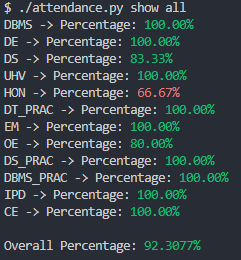

# Attendance Tracker

It is a commandline based attendance tracker using MySQL to store the attendance data. 

## Currently Supported Commands
### `store`
Used to store attendance data and update the database.
### `show `
Used to get the current attendance data as shown above.